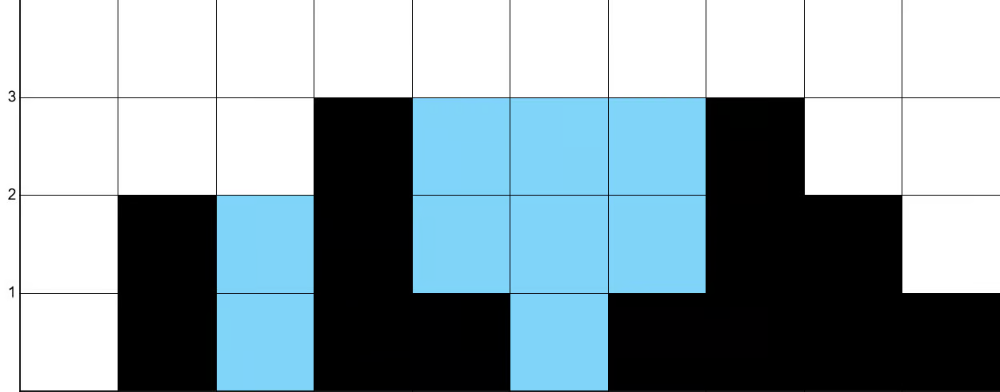

### 42. Trapping Rain Water
---
**Link: [Trapping Rain Water](https://neetcode.io/problems/trapping-rain-water?list=neetcode150)**
**Difficulty: Insane**
**Priority: High**

***

## Understanding the Problem: Trapping Rain Water

>You are given an array of non-negative integers height which represent an elevation map. Each value `height[i]` represents the height of a bar, which has a width of 1.

>>Return the maximum area of water that can be trapped between the bars.

##### Example 1:

`Input: height = [0,2,0,3,1,0,1,3,2,1]`
`Output: 9`

### Optimal Solution (Two Pointers):

Optimized Steps:
Initialize two pointers: left = 0 and right = height.length - 1.
Track left_max and right_max as the maximum seen so far from each end.
While left < right:
If height[left] < height[right]:
If height[left] >= left_max, update left_max.
Else, add left_max - height[left] to total.
Move left forward.
Else:
If height[right] >= right_max, update right_max.
Else, add right_max - height[right] to total.
Move right backward.
This results in O(n) time and O(1) space.

#### Conclusion
The “Trapping Rain Water” problem is an excellent demonstration of how precomputation or two-pointer strategies can optimize time and space complexity. It’s one of the most iconic examples of converting a seemingly brute-force problem into an elegant linear-time solution.

