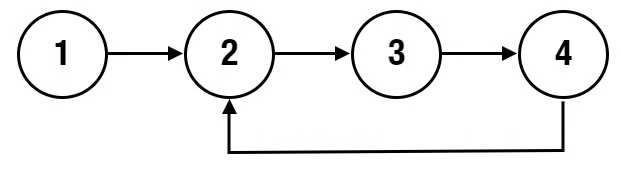

# 03- Linked List Cycle Detection

Difficulty: Easy
Status: Mastred
Priority: High
Time Complexity: O(n)
Space Complexity: Null
Link: https://neetcode.io/problems/linked-list-cycle-detection?list=neetcode250

$$
The Problem
$$

**Given the beginning of a linked list `head`, return `true` if there is a cycle in the linked list. Otherwise, return `false`.**

**There is a cycle in a linked list if at least one node in the list can be visited again by following the `next` pointer.**

**Internally, `index` determines the index of the beginning of the cycle, if it exists. The tail node of the list will set it's `next` pointer to the `index-th` node. If `index = -1`, then the tail node points to `null` and no cycle exists.**

**Note: `index` is not given to you as a parameter.**

$$
Example
$$



```markdown
Input: head = [1,2,3,4], index = 1

Output: true

Explanation: There is a cycle in the linked list, where the tail connects to the 1st node (0-indexed).

```

$$
Solution
$$

```python
# Definition for singly-linked list.
# class ListNode:
#     def __init__(self, val=0, next=None):
#         self.val = val
#         self.next = next

class Solution:
    def hasCycle(self, head: Optional[ListNode]) -> bool:
        if not head:
            return 
        fast, slow = head.next, head
        while fast and fast.next:
            if slow.val == fast.val:
                return True
            slow = slow.next
            fast = fast.next.next
        return False
```

$$
Explaining
$$

```markdown

```

$$
Stuck-Point
$$

```markdown
Null
```