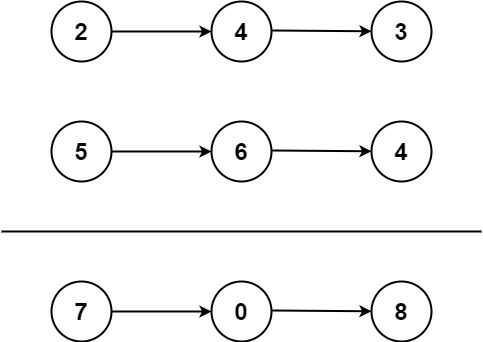

# 07- Add Two Numbers

Difficulty: Medium

Priority: High

Time Complexity: O(n)

Space Complexity: O(1)

[Problem link](https://neetcode.io/problems/add-two-numbers?list=neetcode250)

$$
The Problem
$$

You are given two **non-empty** linked lists representing two non-negative integers. The digits are stored in **reverse order**, and each of their nodes contains a single digit. Add the two numbers and return the sum as a linked list.

You may assume the two numbers do not contain any leading zero, except the number 0 itself.

$$
Example
$$



```markdown
Input: l1 = [2,4,3], l2 = [5,6,4]
Output: [7,0,8]
```

$$
Solution
$$

```python
# Definition for singly-linked list.
# class ListNode:
#     def __init__(self, val=0, next=None):
#         self.val = val
#         self.next = next
class Solution:
    def addTwoNumbers(self, l1: Optional[ListNode], l2: Optional[ListNode]) -> Optional[ListNode]:
        reminder = 0
        dummy = ListNode(0, None)
        NewNode = dummy
        while l1 or l2:
            l1Value = (l1.val if l1 else 0)
            l2Value = (l2.val if l2 else 0)
            total = l1Value + l2Value + reminder
            NewNode.next = ListNode(total % 10)
            reminder = total // 10
            if l1:
                l1 = l1.next
            if l2:
                l2 = l2.next
            
            NewNode = NewNode.next
        if reminder > 0:
            NewNode.next = ListNode(reminder)
            NewNode = NewNode.next
        
        return dummy.next
```

$$
Explaining
$$

```markdown
Null
```

$$
Stuck-Point
$$

```markdown
Null
```