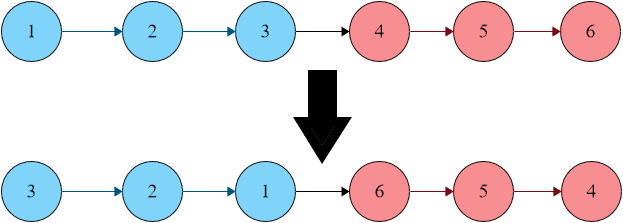

# 14- Reverse Nodes in K-Group

Difficulty: Hard

Time Complexity: O(n)

Space Complexity: O(1)

[Problem Link](https://neetcode.io/problems/reverse-nodes-in-k-group?list=neetcode250)

$$
The Problem
$$

**You are given the head of a singly linked list `head` and a positive integer `k`.**

**You must reverse the first `k` nodes in the linked list, and then reverse the next `k` nodes, and so on. If there are fewer than `k` nodes left, leave the nodes as they are.**

**Return the modified list after reversing the nodes in each group of `k`.**

**You are only allowed to modify the nodes' `next` pointers, not the values of the nodes.**

$$
Example
$$



```markdown
Input: head = [1,2,3,4,5,6], k = 3

Output: [3,2,1,6,5,4]
```

$$
Solution
$$

```python
# Definition for singly-linked list.
# class ListNode:
#     def __init__(self, val=0, next=None):
#         self.val = val
#         self.next = next

class Solution:
    def reverseKGroup(self, head: Optional[ListNode], k: int) -> Optional[ListNode]:
        if not head:
            return
        cnt = 0
        current = head
        while current:
            cnt += 1
            current = current.next
        dummy = ListNode(0)
        dummy.next = head
        dmtemp = dummy
        current = dummy.next
        while cnt >= k:
            prev = None
            for _ in range(k):
                nxt_temp = current.next
                current.next = prev
                prev = current
                current = nxt_temp
            last_node = dmtemp.next
            dmtemp.next.next = current
            dmtemp.next = prev
            dmtemp = last_node
            cnt -= k
        dmtemp.next = current
        return dummy.next
```

$$
Explaining
$$

```markdown
Null
```

$$
Stuck-Point
$$

```markdown
Null
```