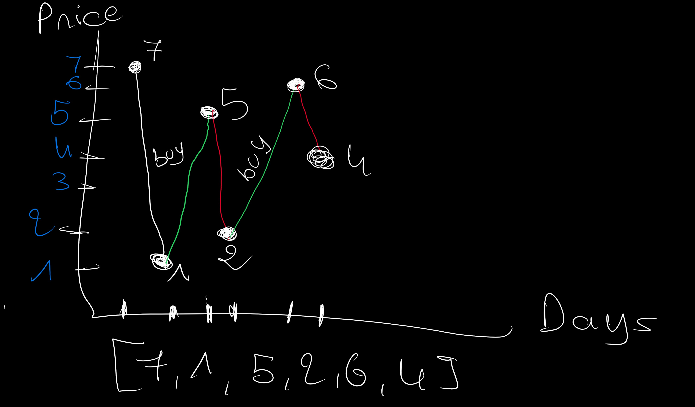

# 19. Best Time to Buy And Sell Stock Il

Difficulty: Medium
Status: Mastred
Priority: Medium
Category: Array, Hashing
Link: https://neetcode.io/problems/best-time-to-buy-and-sell-stock-ii?list=neetcode250

$$
Solution
$$

```python
class Solution:
    def maxProfit(self, prices: List[int]) -> int:
        profit = 0
        start = 0
        for i in range(1, len(prices)):
            if prices[i] > prices[i-1]:
                profit += (prices[i]-prices[i-1])
        return profit
```

$$
Explaining
$$



```
Simple Approach: We Buy In every Rallies
```
